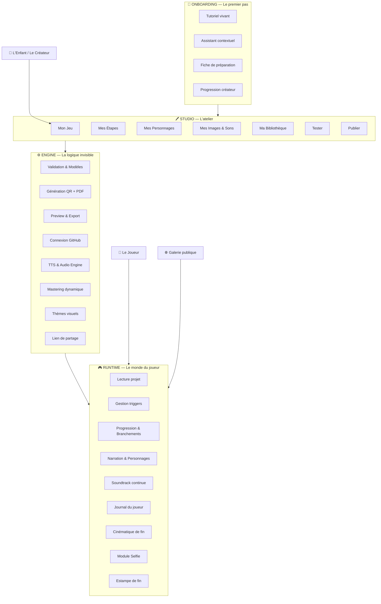
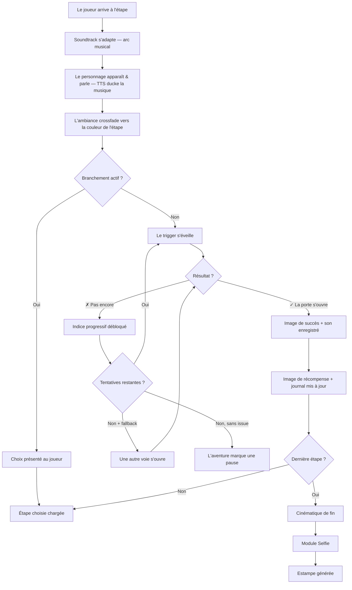
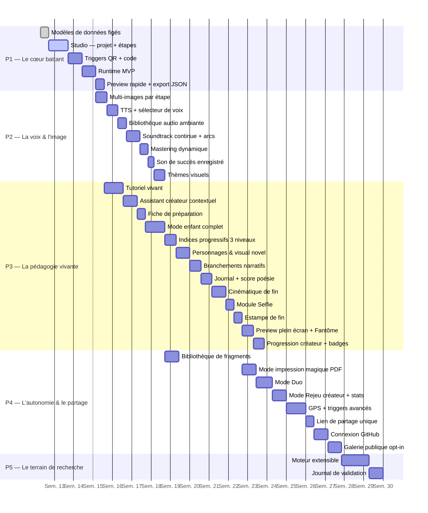

# 🎨 La Fabrique à Souvenirs

> *Un studio web où les enfants fabriquent de vraies aventures — une chasse au trésor qui commence par scanner un arbre, une énigme cachée dans une recette de cuisine, un personnage qui n'apparaît que si tu es au bon endroit.*

---

## 🌱 Une intention, pas une application

Il y a une idée qui court sous ce projet, discrète mais tenace : **et si fabriquer un jeu était plus formateur que d'y jouer ?**

Pas fabriquer au sens industriel — assembler des pièces selon une notice. Fabriquer au sens artisanal : décider, tâtonner, rater, recommencer. Choisir l'endroit où cacher l'indice. Trouver les mots qui donnent envie de chercher. Imaginer ce que l'autre va ressentir quand il arrivera au bon endroit.

La Fabrique à Souvenirs est un studio web pour enfants. On peut y créer des jeux hybrides — des aventures qui se déroulent autant dans le monde physique que sur un écran. Un QR code collé sur un arbre. Un mot de passe glissé sous une pierre. Un personnage qui n'apparaît qu'à la fontaine du parc, à midi pile.

Ce n'est pas une alternative à Scratch. C'est une alternative à l'idée que le numérique est un territoire à consommer plutôt qu'un terrain à défricher.

---

## 🔭 Pour qui, pourquoi

### Pour l'enfant qui crée
Tu as déjà rêvé d'inventer ton propre jeu de piste ? Pas sur une feuille — un vrai jeu, que tes amis peuvent jouer avec leur téléphone, dans la rue, dans le parc, dans ta maison. Où toi tu décides de tout : les lieux, les secrets, les personnages, les épreuves. Où ce que tu imagines devient réel.

### Pour l'adulte qui accompagne
Ce studio est un outil de médiation numérique. L'enfant n'y apprend pas à coder — il apprend à *penser en systèmes* : causes et effets, étapes et transitions, erreurs et indices. Il découvre que derrière chaque application, il y a des décisions humaines. Et que lui aussi peut en prendre.

**Ce que ça développe, concrètement :**
- Structurer une narration en étapes logiques et cohérentes
- Comprendre la relation *si… alors…* sans écrire une ligne de code
- Prendre des décisions de design (*quel indice ? quelle difficulté ? quel ton ?*)
- Penser depuis la perspective de l'autre — le joueur qu'on ne voit pas encore
- Fabriquer quelque chose de jouable par d'autres — et l'assumer

---

## 🏗 Architecture

Trois couches. Séparées avec soin. Le Studio et le Runtime ne se parlent que par le JSON du projet — jamais directement.



Le Studio est l'atelier. Le Runtime est la scène. L'Engine est le machiniste. L'Onboarding est la main tendue — celle qu'on ne voit qu'au début, mais sans qui personne n'entre.

---

## 🧭 Onboarding & Accompagnement

> *Le trou le plus dangereux d'un outil créatif : l'écran vide qui accueille le premier jour.*

### Le Tutoriel Vivant

Quand un enfant ouvre le studio pour la première fois, il ne voit pas un formulaire vide. Il joue d'abord une mini-aventure pré-remplie en 3 étapes — *"Le Mystère de l'Atelier"* — où il est le joueur. Un personnage-guide l'accompagne, parle, réagit.

À la fin de cette mini-aventure, le système dit :
> *"Tu viens de vivre une aventure. Maintenant, c'est toi le créateur. Tu veux modifier celle-ci — ou en inventer une nouvelle ?"*

Ce renversement est le cœur pédagogique du projet. L'enfant comprend de l'intérieur ce qu'il va construire.

```json
{
  "onboarding_project": {
    "id": "tutoriel_atelier",
    "titre": "Le Mystère de l'Atelier",
    "mode": "tutoriel",
    "locked": false,
    "editable_after": true,
    "steps": ["tuto_step_01", "tuto_step_02", "tuto_step_03"],
    "guide_actor": "actor_guide"
  }
}
```

### L'Assistant Créateur Contextuel

À chaque écran du Studio, un petit personnage-guide pose une question pour débloquer l'enfant. Pas une aide technique — une aide de game designer.

| Écran | Blocage détecté | Question posée |
|---|---|---|
| `step.intro` vide depuis 60s | L'enfant ne sait pas quoi écrire | *"Ferme les yeux. Tu arrives à cet endroit. Qu'est-ce que tu vois en premier ?"* |
| `hint_01` vide | L'enfant ne sait pas quel indice donner | *"Pense à quelqu'un qui ne connaît pas cet endroit — qu'est-ce qui l'aiderait sans tout lui dire ?"* |
| `trigger` non choisi | L'enfant hésite | *"Est-ce que le joueur doit trouver quelque chose, aller quelque part, ou prononcer un mot magique ?"* |
| `actor` absent | L'étape semble froide | *"Qui habite cet endroit ? Un gardien, un esprit, un personnage de ton histoire ?"* |
| `reward` vide | L'enfant ne sait pas récompenser | *"Qu'est-ce que le joueur mérite après avoir réussi ça ? Une image, un mot, un secret ?"* |

L'assistant ne s'impose jamais. Il attend. Il observe. Il propose — pas plus.

### La Fiche de Préparation

Avant de toucher au Studio, une page de questions guidées — imprimables ou remplissables directement. Le *story brief* de l'enfant.

```
📋 Mon Aventure

Mon aventure s'appelle : ________________________________
Elle se passe : ________________________________
Elle raconte l'histoire de : ________________________________
Les joueurs devront trouver : ________________________________
La chose la plus difficile sera : ________________________________
La récompense finale, c'est : ________________________________
Le personnage qui guide les joueurs s'appelle : ________________________________
```

L'enfant peut y revenir à tout moment depuis le Studio via un bouton *"Revoir mon idée de départ"*. C'est son ancre créative.

### La Progression Créateur

Un système de badges discret — pas gamifié agressivement. Des marques de chemin, pas des trophées.

| Badge | Condition | Ce que ça débloque |
|---|---|---|
| 🌱 *Premier pas* | Premier jeu publié | Trigger `reach_location` |
| 🎭 *Le Conteur* | Premier personnage créé avec TTS | Voix supplémentaires |
| 👥 *L'Hôte* | Premier joueur extérieur a terminé | Mode Duo |
| 🔀 *L'Architecte* | Première bifurcation narrative | Branchements à 3 options |
| 🔁 *L'Artisan* | Deuxième version d'un jeu publié | Mode Rejeu créateur + stats |
| 🌐 *Le Passeur* | Jeu soumis à la galerie | Bibliothèque de fragments partagée |

La complexité se révèle au rythme de la confiance. Rien n'est verrouillé brutalement — tout est simplement *caché jusqu'au bon moment*.

### Le Mode Rejeu Créateur

Après publication, le créateur peut rejouer son propre jeu en *mode créateur*. À chaque étape, une bulle transparente apparaît :

> *"3 joueurs ont utilisé l'indice 2 ici · Temps moyen : 4 minutes · 1 joueur a abandonné à cette étape"*

Il comprend où son jeu est trop dur, trop facile, où les joueurs s'arrêtent. C'est la pédagogie de l'itération — apprendre en regardant l'autre jouer ce qu'on a fabriqué.

---

## 🔬 Modèles de données

> *La structure d'un jeu ressemble à celle d'une histoire : un fil, des nœuds, des portes. Ce qui change, c'est la clé.*

### `project`
```json
{
  "id": "uuid",
  "titre": "L'Écho des Choses Perdues",
  "description": "Une déambulation en cinq actes dans les replis du quartier.",
  "theme": "exploration",
  "visual_skin": "foret_enchantee",
  "mode": "enfant",
  "author_mode": "solo",
  "auteur": "L'Apprenti Cartographe",
  "version": "1.0.0",
  "created_at": "2025-04-01T10:00:00Z",
  "steps": ["step_01", "step_02", "step_03"],
  "actors": ["actor_01"],
  "assets": ["asset_01", "asset_02"],
  "fragments": ["fragment_01"],
  "audio": {
    "soundtrack_arc": "mystere",
    "ambient_library": "foret_ancienne",
    "success_sound": "asset_son_01",
    "transition_fade_ms": 800,
    "mix": {
      "soundtrack_volume": 0.4,
      "ambient_volume": 0.6,
      "tts_duck_db": -18,
      "success_cut_ms": 1000
    }
  },
  "cinematic": {
    "enabled": true,
    "closing_word": "Tu as traversé l'écho. Il restera en toi.",
    "selfie_enabled": true
  },
  "publishing": {
    "status": "published",
    "share_url": "fabrique.jeu/echo-des-choses-perdues",
    "gallery_opt_in": true,
    "github_repo": "apprenti-cartographe/echo-perdues",
    "last_saved": "2025-04-01T11:30:00Z"
  }
}
```
`theme` : `exploration | indices | defis`
`visual_skin` : `foret_enchantee | ville_mystere | espace | fond_marin | neutre`
`soundtrack_arc` : `mystere | aventure | melancolie | triomphe`
`author_mode` : `solo | duo`

---

### `step`
```json
{
  "id": "step_01",
  "titre": "Le Seuil du Murmure",
  "intro": "Certaines portes ne s'ouvrent qu'à ceux qui savent où poser les yeux.",
  "actor": "actor_01",
  "images": {
    "on_arrive":  "asset_01",
    "on_success": "asset_02",
    "on_reward":  "asset_03"
  },
  "ambient_sound": "foret_ancienne",
  "tts": {
    "enabled": true,
    "voice_id": "voix_grave",
    "read_intro": true,
    "read_hints": true
  },
  "trigger": "trigger_01",
  "hints": ["hint_01", "hint_02", "hint_03"],
  "challenge": "challenge_01",
  "reward": "reward_01",
  "branches": {
    "enabled": false,
    "choice_label": null,
    "options": []
  },
  "nextStep": "step_02"
}
```

---

### `branch` — le branchement narratif

> *Un choix binaire suffit pour que chaque joueur vive une aventure légèrement différente.*

```json
{
  "id": "branch_01",
  "step_id": "step_02",
  "choice_label": "Deux chemins s'offrent à toi. Lequel prends-tu ?",
  "options": [
    {
      "label": "La porte de droite — là où la lumière filtre",
      "nextStep": "step_03a"
    },
    {
      "label": "La porte de gauche — là où l'ombre est plus douce",
      "nextStep": "step_03b"
    }
  ]
}
```

---

### `actor` — le personnage parlant
```json
{
  "id": "actor_01",
  "nom": "La Tisseuse de Brumes",
  "illustration": "asset_gardienne",
  "voice_id": "voix_douce",
  "apparition": "overlay",
  "phrase_accueil": "Tu es venu. Je savais que tu viendrais."
}
```

---

### `hint` — les indices progressifs

> *Trois niveaux. Le premier donne une direction. Le deuxième donne un sens. Le troisième donne la réponse. Chaque échec débloque le suivant.*

```json
[
  {
    "id": "hint_01",
    "level": 1,
    "text": "La réponse se trouve là où le regard s'arrête naturellement.",
    "unlocks_after_attempts": 1
  },
  {
    "id": "hint_02",
    "level": 2,
    "text": "Regarde sous le banc de bois, côté ombre.",
    "unlocks_after_attempts": 2
  },
  {
    "id": "hint_03",
    "level": 3,
    "text": "Le mot est MÉMOIRE, écrit à la craie blanche.",
    "unlocks_after_attempts": 3
  }
]
```

---

### `trigger` — les cinq façons d'ouvrir une porte

> *Un trigger est une promesse : si tu fais ça, quelque chose se passe. C'est la mécanique la plus ancienne du jeu.*

#### `scan_qr` — La marque visible
```json
{
  "id": "trigger_01",
  "type": "scan_qr",
  "params": {
    "qr_data": "fabrique-echo-step_01",
    "qr_label": "Glisse ce signe sur le mur du fond",
    "qr_animated": true
  },
  "help_text": "Quelque part dans cet espace, une marque attend d'être lue.",
  "success_message": "Le signe t'a reconnu. Continue.",
  "error_message": "Ce n'est pas la bonne marque. Cherche encore.",
  "fallback": "trigger_01_code"
}
```

#### `enter_code` — Le mot de passe
```json
{
  "id": "trigger_02",
  "type": "enter_code",
  "params": {
    "expected_code": "MEMOIRE",
    "case_sensitive": false,
    "max_attempts": 3
  },
  "help_text": "Le mot est gravé quelque part. Pas forcément là où tu le cherches.",
  "success_message": "Le mot juste. La porte s'ouvre.",
  "error_message": "Presque. Regarde autrement.",
  "fallback": null
}
```

#### `reach_location` — Le lieu juste
```json
{
  "id": "trigger_03",
  "type": "reach_location",
  "params": {
    "lat": 48.8566,
    "lng": 2.3522,
    "radius_m": 15,
    "requires_confirmation": false
  },
  "help_text": "Il faut être là où le bruit du monde change de tonalité.",
  "success_message": "Tu es exactement où tu devais être.",
  "error_message": "Pas encore. Continue à te déplacer.",
  "fallback": "trigger_03_code"
}
```

#### `find_object` — La chose cachée
```json
{
  "id": "trigger_04",
  "type": "find_object",
  "params": {
    "object_description": "Une enveloppe couleur de cendre, glissée dans le repli du vieux banc.",
    "confirmation_type": "button",
    "confirmation_label": "Je l'ai trouvée."
  },
  "help_text": "Les choses importantes se cachent à hauteur d'enfant.",
  "success_message": "Tu savais regarder au bon endroit.",
  "error_message": null,
  "fallback": null
}
```

#### `perform_action` — Le geste rituel
```json
{
  "id": "trigger_05",
  "type": "perform_action",
  "params": {
    "action_description": "Ferme les yeux. Compte jusqu'à sept. Rouvre-les.",
    "confirmation_type": "button",
    "confirmation_label": "C'est fait.",
    "uses_sensor": false
  },
  "help_text": "Certaines étapes demandent un geste, pas un code.",
  "success_message": "Tu as traversé le seuil.",
  "error_message": null,
  "fallback": null
}
```

---

### `asset` — images, sons, QR
```json
{
  "id": "asset_01",
  "titre": "La Gardienne du Passage",
  "source": "local",
  "type": "image",
  "droits": "auteur",
  "usage": ["step_01", "reward_01"]
}
```
```json
{
  "id": "asset_son_01",
  "titre": "Mon cri de victoire",
  "source": "recorded",
  "type": "sound",
  "duration_ms": 2400,
  "droits": "auteur",
  "usage": ["project.audio.success_sound"]
}
```
`source` : `local | library | url | recorded`
`type` : `image | sound | qr | map`

---

### `fragment` — le bloc réutilisable

> *Sa bibliothèque personnelle qui grandit avec lui.*

```json
{
  "id": "fragment_01",
  "type": "actor",
  "label": "La Tisseuse de Brumes",
  "ref": "actor_01",
  "used_in": ["echo-des-choses-perdues", "le-jardin-des-murmures"]
}
```
`type` : `actor | ambient | challenge | trigger_template`

---

## ⚙️ La logique du trigger

> *Chaque étape est une question posée au monde. La réponse peut venir de mille façons — l'important, c'est qu'elle arrive.*



---

## 🎧 Couche Audio

> *Le son est la première chose qu'on oublie de penser, et la dernière qu'on cesse d'entendre.*

### Soundtrack Continue — les 4 arcs musicaux

La musique traverse tout le jeu. Elle a sa propre progression narrative, indépendante des ambiances par étape.

| Arc | Début | Milieu | Climax | Résolution |
|---|---|---|---|---|
| `mystere` | Nappes lentes, cloche lointaine | Tension harmonique montante | Ostinato tendu | Accord suspendu qui se pose |
| `aventure` | Thème héroïque simple | Accélération rythmique | Tutti orchestral | Fanfare douce |
| `melancolie` | Piano seul, notes éparses | Cordes qui entrent | Crescendo émotionnel | Silence, puis une note |
| `triomphe` | Percussions légères | Cuivres qui s'éveillent | Explosion rythmique | Marche victorieuse |

La progression est automatique : le moteur divise le nombre d'étapes en 4 segments et applique la phase correspondante. L'enfant choisit un arc — le reste se gère seul.

### Mastering Dynamique

Un mini-moteur de ducking entièrement automatique :

```json
{
  "audio_mix": {
    "soundtrack_volume": 0.4,
    "ambient_volume": 0.6,
    "tts_duck_db": -18,
    "tts_duck_attack_ms": 200,
    "tts_duck_release_ms": 500,
    "success_sound_cut_ms": 1000,
    "step_crossfade_ms": 800
  }
}
```

Règles automatiques :
- TTS activé → soundtrack descend à -18dB · remonte 500ms après la fin de parole
- Son de succès → ambiance se coupe 1 seconde
- Nouvelle étape → crossfade propre entre les deux ambiances (800ms)
- Cinématique → soundtrack monte progressivement vers le climax

En mode enfant : invisible. En mode avancé : sliders ajustables par projet.

### Bibliothèque d'Ambiances (CC0)

| ID | Ambiance |
|---|---|
| `foret_ancienne` | Forêt dense, oiseaux lointains |
| `cour_mystere` | Cour intérieure, vent léger |
| `marche_nocturne` | Pas sur pavés, nuit urbaine |
| `bibliotheque_oubliee` | Craquements, silence habité |
| `bord_de_l_eau` | Rivière, cailloux, écho |
| `grenier_des_secrets` | Bois qui craque, horloge lointaine |

### Text-to-Speech natif
Web Speech API — zéro dépendance, zéro serveur.

```json
{
  "tts_config": {
    "engine": "Web Speech API",
    "voice_options": [
      { "id": "voix_douce",   "label": "La Conteuse",  "pitch": 1.2, "rate": 0.9  },
      { "id": "voix_grave",   "label": "Le Gardien",   "pitch": 0.7, "rate": 0.85 },
      { "id": "voix_enfant",  "label": "L'Espiègle",   "pitch": 1.5, "rate": 1.0  },
      { "id": "voix_murmure", "label": "L'Ombre",      "pitch": 0.9, "rate": 0.75 }
    ],
    "reads": ["step.intro", "hint.text", "actor.phrase_accueil"]
  }
}
```

### Son de Succès Enregistré
L'enfant enregistre lui-même (MediaRecorder API, 3 secondes max) le son de réussite. Sa propre voix devient partie intégrante de l'expérience du joueur.

---

## 🖼 Multi-images & Révélation Progressive

Chaque étape dispose de trois moments visuels distincts :

| Moment | Quand | Ce que ça raconte |
|---|---|---|
| `on_arrive` | Dès l'arrivée | Le lieu, l'atmosphère, le mystère |
| `on_success` | Trigger franchi | La révélation, la transformation |
| `on_reward` | Récompense remise | La victoire, le souvenir |

---

## 🎨 Thèmes Visuels par Univers

> *L'enfant choisit un univers et tout se coordonne — typographie, palette, transitions, icônes.*

| `visual_skin` | Palette | Typo | Transitions |
|---|---|---|---|
| `foret_enchantee` | Verts profonds, or | Serif organique | Fondu feuilles |
| `ville_mystere` | Bleus nuit, néon | Mono angulaire | Glitch subtil |
| `espace` | Noirs, violets, blanc | Futuriste fine | Warp étoiles |
| `fond_marin` | Teals, turquoise | Arrondie fluide | Ondulation |
| `neutre` | Gris doux, blanc | Sans-serif propre | Fondu simple |

---

## 🎬 Cinématique de Fin

> *Pas d'interaction. Juste contempler. C'est suffisant.*

Séquence automatique déclenchée après la dernière étape franchie. Durée fixe : 20-30 secondes.

```
[0s]    Fondu depuis la dernière image de récompense
[2s]    Les personnages du jeu défilent un par un
        — illustration + phrase marquante + voix TTS
[12s]   Le fond change selon le skin visuel
        — la musique monte vers le climax de l'arc
[18s]   Le "mot de la fin" écrit par le créateur apparaît
        — lettre par lettre, lentement
[24s]   Fondu blanc total
[26s]   Module Selfie s'active (si activé)
[30s]   Estampe de fin générée et présentée
```

Le créateur peut écrire un *mot de la fin* depuis le Studio :
```json
{
  "cinematic": {
    "enabled": true,
    "closing_word": "Tu as traversé l'écho. Il restera en toi.",
    "selfie_enabled": true,
    "actor_parade": true
  }
}
```

---

## 📸 Module Selfie

À la fin de la cinématique, avant l'estampe : *"Prends un souvenir."*

La caméra s'ouvre. Le joueur se prend en photo. Cette photo est incrustée dans l'estampe finale — son visage dans le cadre du jeu qu'il vient de vivre.

Optionnel, désactivable par le créateur. La photo n'est jamais envoyée nulle part — elle reste dans le navigateur, utilisée uniquement pour composer l'estampe locale.

---

## 🏮 Estampe de Fin

> *Un souvenir physique d'une aventure numérique.*

Image unique générée côté client (Canvas API) combinant :
- Le titre de l'aventure en grand
- Le selfie du joueur (si activé) dans un cadre stylisé selon le skin
- Le nom du joueur
- La date et la durée de l'aventure
- Une illustration tirée des assets du projet
- Le score poésie sous forme de symbole
- Le "mot de la fin" du créateur

Exportable en PNG, partageable, imprimable.

---

## 📖 Journal du Joueur

> *À la fin d'une aventure, ce qu'on garde, c'est rarement la solution. C'est le chemin.*

```json
{
  "journal": {
    "aventure": "L'Écho des Choses Perdues",
    "joueur": "L'Intrépide",
    "debut": "2025-04-01T14:00:00Z",
    "fin": "2025-04-01T15:23:00Z",
    "etapes": [
      {
        "step_id": "step_01",
        "titre": "Le Seuil du Murmure",
        "franchie_a": "2025-04-01T14:12:00Z",
        "tentatives": 2,
        "indices_utilises": 1,
        "branche_choisie": null
      }
    ],
    "score_poesie": 87
  }
}
```

Le *score poésie* récompense l'exploration tranquille : peu d'indices utilisés, du temps passé sur chaque étape, des branchements osés. Ce n'est pas un score de performance — c'est un score de présence.

---

## ✨ Personnages & Visual Novel léger

```
┌─────────────────────────────────┐
│                                 │
│         [image étape]           │
│                                 │
│  ┌──────────────────────────┐   │
│  │  🌫 La Tisseuse de Brumes │   │
│  │  "Tu es venu. Je savais  │   │
│  │   que tu viendrais."     │   │
│  └──────────────────────────┘   │
│                                 │
│        [ Trigger actif ]        │
└─────────────────────────────────┘
```

---

## 👁 Mode Preview

**Preview rapide** — panneau latéral glissant avec simulation son + personnage + images. Triggers simulés par bouton unique.

**Preview plein écran** — simulation exacte. Bouton semi-transparent *"Passer ce trigger"* pour tester sans QR imprimé.

**Mode Fantôme** — le créateur voit en transparence ses propres notes de conception derrière chaque décision. Outil de relecture pédagogique.

---

## 🖨 Mode Impression Magique

Un bouton *"Préparer l'aventure"* génère un PDF prêt à imprimer :
- Tous les QR codes numérotés et étiquetés
- Les étiquettes à découper et coller
- Les enveloppes avec leur contenu suggéré
- La checklist de mise en place du créateur
- La page de couverture avec titre et illustration

---

## 🤝 Mode Duo

Deux enfants créent ensemble via une session partagée — même projet ouvert sur deux appareils, lancé par QR code.

```json
{
  "author_mode": "duo",
  "duo_session": {
    "host": "L'Apprenti Cartographe",
    "guest": "La Tisseuse de Cartes",
    "share_qr": "fabrique.jeu/session/echo-duo-abc123",
    "roles": {
      "host": ["intro", "hints", "rewards"],
      "guest": ["images", "actors", "sounds"]
    }
  }
}
```

Pas de synchronisation temps réel complexe — les modifications se mergent à la sauvegarde. En mode enfant : *"Créer à deux"* avec un QR code à montrer à l'ami.

---

## 🌐 Partage & Galerie

Chaque aventure publiée reçoit un lien unique :
```
fabrique.jeu/echo-des-choses-perdues
```

Le Runtime charge depuis GitHub Pages, fonctionne offline après le premier chargement (PWA).

**Galerie publique opt-in** — soumission via Pull Request GitHub, pas de compte requis. Chaque carte : titre, univers, auteur, nombre d'étapes, bouton *"Jouer"*.

---

## 🧩 Bibliothèque de Fragments

Blocs réutilisables entre plusieurs projets. Types : `actor | ambient | challenge | trigger_template`.

En mode enfant : *"Utiliser un personnage déjà créé"* — un picker simple.
En mode avancé : gestion complète, import/export, partage entre créateurs.

---

## 🎯 Périmètre MVP — Le premier jeu jouable

> *Un jeu à trois étapes, partageable en moins de 30 minutes.*

### Ce que le créateur peut faire
- [ ] Jouer le tutoriel vivant et le modifier
- [ ] Nommer son projet, choisir skin visuel et arc musical
- [ ] Ajouter, éditer et réordonner des étapes
- [ ] Choisir `scan_qr` ou `enter_code` pour chaque étape
- [ ] Associer jusqu'à 3 images par étape
- [ ] Choisir une ambiance sonore par étape
- [ ] Créer un personnage avec illustration et voix TTS
- [ ] Écrire 3 niveaux d'indices par étape
- [ ] Générer un QR code animé imprimable
- [ ] Enregistrer son propre son de succès
- [ ] Écrire le mot de la fin + activer le selfie
- [ ] Prévisualiser en mode rapide ou plein écran
- [ ] Générer le PDF impression magique
- [ ] Exporter et partager via lien unique

### Ce que le joueur peut vivre
- [ ] Charger une aventure via lien ou fichier
- [ ] Entendre la soundtrack s'adapter à sa progression
- [ ] Rencontrer des personnages qui parlent
- [ ] Scanner un QR ou entrer un code
- [ ] Débloquer des indices progressifs
- [ ] Faire des choix narratifs aux embranchements
- [ ] Vivre la cinématique de fin
- [ ] Se prendre en selfie
- [ ] Recevoir son estampe personnalisée
- [ ] Consulter son journal de bord

---

## 👧 L'atelier en mode enfant

> *La meilleure interface est celle qui disparaît. L'enfant ne doit pas sentir l'outil — il doit sentir son propre pouvoir de création.*

### Écran "Mon Jeu"
| Élément | Ce que ça cache |
|---|---|
| Nom de l'aventure | `project.titre` |
| Univers visuel | `project.visual_skin` |
| Musique du voyage | `project.audio.soundtrack_arc` |
| Image de couverture | `project.asset_cover` |
| Couleur sonore | `project.audio.ambient_library` |
| `+ Ajouter une étape` | Création d'un `step` |
| `▶ Tester l'aventure` | Preview rapide |
| `🖨 Préparer l'aventure` | Génération PDF |
| `🌐 Partager` | Publication + lien unique |

### Écran "Une Étape"
| Ce qu'on demande | Ce que ça mappe |
|---|---|
| *Que se passe-t-il ici ?* | `step.intro` |
| *Qui accueille le joueur ?* | `step.actor` |
| *Quelle ambiance sonore ?* | `step.ambient_sound` |
| *Quelle image en arrivant ?* | `step.images.on_arrive` |
| *Comment le joueur passe-t-il ?* | `trigger.type` |
| *Et s'il est bloqué ?* | `step.hints` (3 niveaux) |
| *Quelle image en réussissant ?* | `step.images.on_success` |
| *Qu'est-ce qu'il gagne ?* | `reward` + `step.images.on_reward` |
| *Y a-t-il un choix ici ?* | `branch` (optionnel) |

Sélecteur trigger — icônes uniquement :
- 📷 Scanner un signe → `scan_qr`
- 🔑 Prononcer le mot juste → `enter_code`
- 📍 Se rendre au bon endroit → `reach_location`
- 🔍 Trouver l'objet caché → `find_object`
- 👐 Accomplir le geste → `perform_action`

### Ce qui se passe en coulisses
IDs · JSON · GitHub (sauvegarde silencieuse) · GPS brut · `fallback` · `max_attempts` · `voice_id` · mix audio · structure fragments

---

## 📋 Roadmap



**Dépendances clés :**
- P2 démarre dès que le Runtime MVP (P1) est stable
- P3 tutoriel peut démarrer en parallèle de P2 — indépendant
- Les branchements (P3) nécessitent les modèles multi-steps stables
- La cinématique nécessite la soundtrack (P2) et les personnages (P3)
- GitHub et galerie (P4) ne sont exposés qu'après P3 complet
- P5 est indépendant, peut avancer en parallèle de P4

---

## 💻 Ce sur quoi ça repose

| Couche | Choix et raison |
|---|---|
| Frontend | Vanilla JS modulaire — pas de bundler, pas de dépendance invisible |
| Données | JSON local (`localStorage` + export fichier), schéma versionné |
| QR génération | `qrcode.js` — légère, sans build |
| QR scan | Web Camera API native |
| Géolocalisation | Web Geolocation API native |
| TTS | Web Speech API native — zéro serveur |
| Audio ambiant + soundtrack | Web Audio API + fichiers CC0 embarqués |
| Mastering | Web Audio API GainNode + scheduling |
| Enregistrement selfie/son | MediaRecorder API + getUserMedia native |
| Estampe de fin | Canvas API — composition PNG côté client |
| PDF impression | `jsPDF` + `html2canvas` — génération côté client |
| Galerie | GitHub Pull Request API — pas de backend |
| Partage | GitHub Pages + URL canonique par projet |
| GitHub | REST API v3 — uniquement en P4 |
| Offline | Service Worker PWA — le Runtime fonctionne sans réseau |
| Déploiement | GitHub Pages |

---

## 🕊 Ce que ce projet cherche, au fond

Il y a quelque chose de politique, doucement, dans l'idée de donner aux enfants les outils pour fabriquer plutôt que les interfaces pour consommer. Pas au sens militant — au sens littéral : comprendre comment une chose est faite change la façon dont on la regarde.

Un enfant qui a construit un jeu de piste avec des QR codes ne verra plus jamais un QR code de la même façon. Un enfant qui a choisi les mots d'une énigme sait que derrière chaque interface, quelqu'un a décidé de ces mots. Un enfant qui a imaginé deux chemins possibles comprend que les choix qu'on nous propose ont été fabriqués — et qu'on aurait pu en proposer d'autres.

Un enfant qui a regardé ses amis jouer à ce qu'il a inventé, qui a vu où ils ont souri et où ils ont buté, qui a décidé de modifier son jeu après — cet enfant-là a appris quelque chose que aucun cours ne peut vraiment enseigner : que le monde peut être réenchanté par ceux qui acceptent d'y poser les mains.

C'est ça, l'émancipation numérique. Pas apprendre à coder. Apprendre que le monde numérique a été fabriqué — et qu'on peut en fabriquer un autre.

*Fait avec cœur et rigueur, pour que le numérique redevienne un terrain de jeu poétique.*
