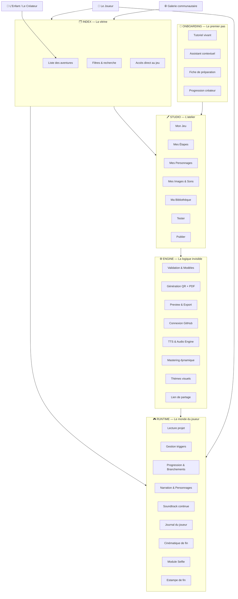
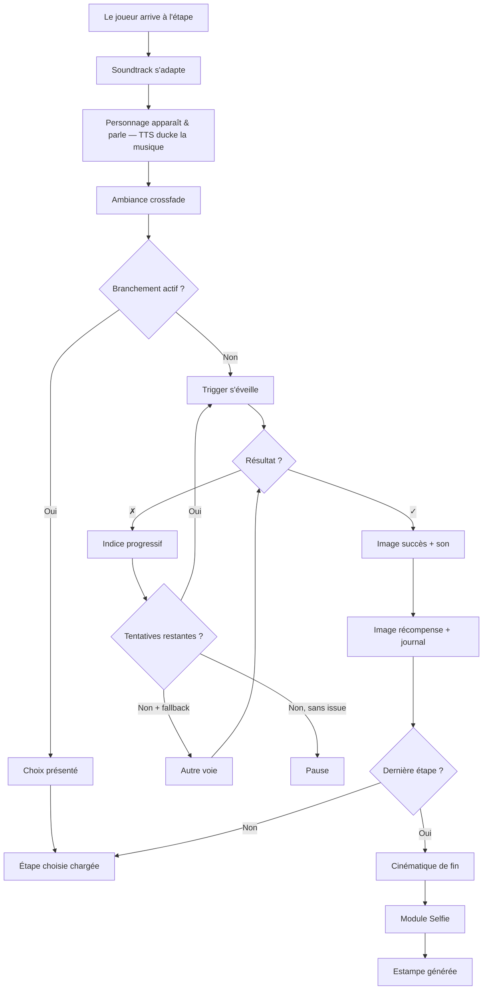
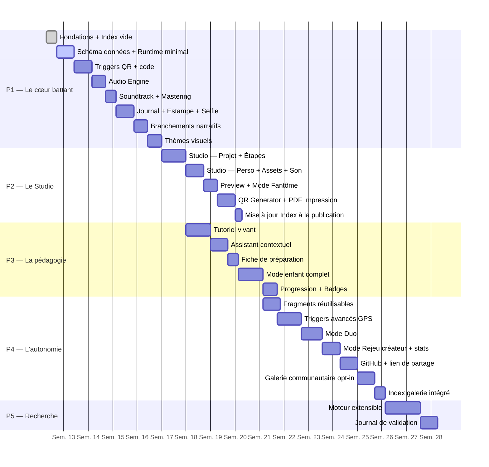

# 🎨 La Fabrique à Souvenirs

> *Un studio web où les enfants fabriquent de vraies aventures — une chasse au trésor qui commence par scanner un arbre, une énigme cachée dans une recette de cuisine, un personnage qui n'apparaît que si tu es au bon endroit.*

---

## 🌱 Une intention, pas une application

Il y a une idée qui court sous ce projet, discrète mais tenace : **et si fabriquer un jeu était plus formateur que d'y jouer ?**

Pas fabriquer au sens industriel — assembler des pièces selon une notice. Fabriquer au sens artisanal : décider, tâtonner, rater, recommencer. Choisir l'endroit où cacher l'indice. Trouver les mots qui donnent envie de chercher. Imaginer ce que l'autre va ressentir quand il arrivera au bon endroit.

La Fabrique à Souvenirs est un studio web pour enfants. On peut y créer des jeux hybrides — des aventures qui se déroulent autant dans le monde physique que sur un écran. Un QR code collé sur un arbre. Un mot de passe glissé sous une pierre. Un personnage qui n'apparaît qu'à la fontaine du parc, à midi pile.

Ce n'est pas une alternative à Scratch. C'est une alternative à l'idée que le numérique est un territoire à consommer plutôt qu'un terrain à défricher.

---

## 🔭 Pour qui, pourquoi

### Pour l'enfant qui crée
Tu as déjà rêvé d'inventer ton propre jeu de piste ? Pas sur une feuille — un vrai jeu, que tes amis peuvent jouer avec leur téléphone, dans la rue, dans le parc, dans ta maison. Où toi tu décides de tout : les lieux, les secrets, les personnages, les épreuves. Où ce que tu imagines devient réel.

### Pour l'adulte qui accompagne
Ce studio est un outil de médiation numérique. L'enfant n'y apprend pas à coder — il apprend à *penser en systèmes* : causes et effets, étapes et transitions, erreurs et indices. Il découvre que derrière chaque application, il y a des décisions humaines. Et que lui aussi peut en prendre.

**Ce que ça développe, concrètement :**
- Structurer une narration en étapes logiques et cohérentes
- Comprendre la relation *si… alors…* sans écrire une ligne de code
- Prendre des décisions de design (*quel indice ? quelle difficulté ? quel ton ?*)
- Penser depuis la perspective de l'autre — le joueur qu'on ne voit pas encore
- Fabriquer quelque chose de jouable par d'autres — et l'assumer

---

## 🏗 Architecture

Quatre couches. Séparées avec soin. Le Studio et le Runtime ne se parlent que par le JSON du projet — jamais directement.



L'Index est la porte d'entrée du site. Le Studio est l'atelier. Le Runtime est la scène. L'Engine est le machiniste. L'Onboarding est la main tendue.

---

## 🗂 Index des Aventures

> *La première chose qu'un visiteur voit. Pas le Studio, pas un formulaire — des aventures qui donnent envie de jouer.*

L'index est une page HTML statique (`index.html`) alimentée par un fichier `adventures.json` versionné dans le repo. Quand une aventure est publiée, ce fichier est mis à jour automatiquement.

### Structure de `adventures.json`
```json
{
  "updated_at": "2025-04-01T12:00:00Z",
  "adventures": [
    {
      "id": "echo-des-choses-perdues",
      "titre": "L'Écho des Choses Perdues",
      "description": "Une déambulation en cinq actes dans les replis du quartier.",
      "auteur": "L'Apprenti Cartographe",
      "visual_skin": "foret_enchantee",
      "theme": "exploration",
      "nb_steps": 5,
      "duration_min": 30,
      "published_at": "2025-04-01T10:00:00Z",
      "play_url": "runtime.html?project=echo-des-choses-perdues",
      "cover_image": "assets/covers/echo.jpg",
      "gallery": true
    },
    {
      "id": "le-sanctuaire-des-9-nekos",
      "titre": "Le Sanctuaire des 9 Nekos",
      "description": "Neuf gardiens à réveiller. Neuf épreuves à traverser.",
      "auteur": "Curiosités Incongrues",
      "visual_skin": "foret_enchantee",
      "theme": "defis",
      "nb_steps": 9,
      "duration_min": 60,
      "published_at": "2024-01-01T00:00:00Z",
      "play_url": "runtime.html?project=sanctuaire-nekos",
      "cover_image": "assets/covers/nekos.jpg",
      "gallery": false
    }
  ]
}
```

### Ce que l'index affiche

Chaque carte d'aventure montre :
- Image de couverture + skin visuel appliqué
- Titre, auteur, description courte
- Durée estimée + nombre d'étapes
- Thème (icône) + badges éventuels
- Bouton `▶ Jouer` → ouvre directement le Runtime

Filtres disponibles : par thème, par durée, par skin, par auteur.

### Deux niveaux de catalogue

| Niveau | Contenu | Qui voit |
|---|---|---|
| **Index local** | Toutes les aventures du repo (publiques + privées marquées) | Propriétaire + invités avec le lien |
| **Galerie communautaire** | Adventures soumises opt-in par n'importe quel créateur | Tout le monde |

L'index local est posé dès le Bloc 0 (structure + `adventures.json` vide). Il se peuple à chaque publication.

---

## 🧭 Onboarding & Accompagnement

> *Le trou le plus dangereux d'un outil créatif : l'écran vide qui accueille le premier jour.*

### Le Tutoriel Vivant

Quand un enfant ouvre le studio pour la première fois, il joue d'abord une mini-aventure pré-remplie en 3 étapes — *"Le Mystère de l'Atelier"*. À la fin, le système bascule :

> *"Tu viens de vivre une aventure. Maintenant, c'est toi le créateur. Tu veux modifier celle-ci — ou en inventer une nouvelle ?"*

Ce renversement est le cœur pédagogique du projet.

### L'Assistant Créateur Contextuel

À chaque écran du Studio, un personnage-guide pose une question pour débloquer l'enfant — pas une aide technique, une aide de game designer.

| Blocage détecté | Question posée |
|---|---|
| `step.intro` vide depuis 60s | *"Ferme les yeux. Tu arrives à cet endroit. Qu'est-ce que tu vois en premier ?"* |
| `hint_01` vide | *"Pense à quelqu'un qui ne connaît pas cet endroit — qu'est-ce qui l'aiderait sans tout lui dire ?"* |
| `trigger` non choisi | *"Est-ce que le joueur doit trouver quelque chose, aller quelque part, ou prononcer un mot magique ?"* |
| `actor` absent | *"Qui habite cet endroit ? Un gardien, un esprit, un personnage de ton histoire ?"* |
| `reward` vide | *"Qu'est-ce que le joueur mérite après avoir réussi ça ?"* |

### La Fiche de Préparation

Avant de toucher au Studio, une page de questions guidées — imprimables ou remplissables.

```
📋 Mon Aventure

Mon aventure s'appelle : ________________________________
Elle se passe : ________________________________
Elle raconte l'histoire de : ________________________________
Les joueurs devront trouver : ________________________________
La chose la plus difficile sera : ________________________________
La récompense finale, c'est : ________________________________
Le personnage qui guide les joueurs s'appelle : ________________________________
```

### La Progression Créateur

Badges discrets qui débloquent la complexité progressivement :

| Badge | Condition | Ce que ça débloque |
|---|---|---|
| 🌱 *Premier pas* | Premier jeu publié | Trigger `reach_location` |
| 🎭 *Le Conteur* | Premier personnage avec TTS | Voix supplémentaires |
| 👥 *L'Hôte* | Premier joueur extérieur termine | Mode Duo |
| 🔀 *L'Architecte* | Première bifurcation narrative | Branchements à 3 options |
| 🔁 *L'Artisan* | Deuxième version publiée | Mode Rejeu + stats |
| 🌐 *Le Passeur* | Jeu soumis à la galerie | Bibliothèque fragments partagée |

### Le Mode Rejeu Créateur

Après publication, le créateur rejoue son propre jeu avec des bulles de stats transparentes :
> *"3 joueurs ont utilisé l'indice 2 ici · Temps moyen : 4 minutes · 1 joueur a abandonné"*

---

## 🔬 Modèles de données

> *La structure d'un jeu ressemble à celle d'une histoire : un fil, des nœuds, des portes. Ce qui change, c'est la clé.*

### `project`
```json
{
  "id": "uuid",
  "titre": "L'Écho des Choses Perdues",
  "description": "Une déambulation en cinq actes dans les replis du quartier.",
  "theme": "exploration",
  "visual_skin": "foret_enchantee",
  "mode": "enfant",
  "author_mode": "solo",
  "auteur": "L'Apprenti Cartographe",
  "version": "1.0.0",
  "created_at": "2025-04-01T10:00:00Z",
  "steps": ["step_01", "step_02", "step_03"],
  "actors": ["actor_01"],
  "assets": ["asset_01", "asset_02"],
  "fragments": ["fragment_01"],
  "audio": {
    "soundtrack_arc": "mystere",
    "ambient_library": "foret_ancienne",
    "success_sound": "asset_son_01",
    "transition_fade_ms": 800,
    "mix": {
      "soundtrack_volume": 0.4,
      "ambient_volume": 0.6,
      "tts_duck_db": -18,
      "success_cut_ms": 1000
    }
  },
  "cinematic": {
    "enabled": true,
    "closing_word": "Tu as traversé l'écho. Il restera en toi.",
    "selfie_enabled": true
  },
  "publishing": {
    "status": "published",
    "share_url": "fabrique.jeu/echo-des-choses-perdues",
    "gallery_opt_in": true,
    "github_repo": "apprenti-cartographe/echo-perdues",
    "last_saved": "2025-04-01T11:30:00Z"
  }
}
```
`theme` : `exploration | indices | defis`
`visual_skin` : `foret_enchantee | ville_mystere | espace | fond_marin | neutre`
`soundtrack_arc` : `mystere | aventure | melancolie | triomphe`
`author_mode` : `solo | duo`

---

### `step`
```json
{
  "id": "step_01",
  "titre": "Le Seuil du Murmure",
  "intro": "Certaines portes ne s'ouvrent qu'à ceux qui savent où poser les yeux.",
  "actor": "actor_01",
  "images": {
    "on_arrive":  "asset_01",
    "on_success": "asset_02",
    "on_reward":  "asset_03"
  },
  "ambient_sound": "foret_ancienne",
  "tts": {
    "enabled": true,
    "voice_id": "voix_grave",
    "read_intro": true,
    "read_hints": true
  },
  "trigger": "trigger_01",
  "hints": ["hint_01", "hint_02", "hint_03"],
  "challenge": "challenge_01",
  "reward": "reward_01",
  "branches": {
    "enabled": false,
    "choice_label": null,
    "options": []
  },
  "nextStep": "step_02"
}
```

---

### `branch`
```json
{
  "id": "branch_01",
  "step_id": "step_02",
  "choice_label": "Deux chemins s'offrent à toi. Lequel prends-tu ?",
  "options": [
    { "label": "La porte de droite — là où la lumière filtre", "nextStep": "step_03a" },
    { "label": "La porte de gauche — là où l'ombre est plus douce", "nextStep": "step_03b" }
  ]
}
```

### `actor`
```json
{
  "id": "actor_01",
  "nom": "La Tisseuse de Brumes",
  "illustration": "asset_gardienne",
  "voice_id": "voix_douce",
  "apparition": "overlay",
  "phrase_accueil": "Tu es venu. Je savais que tu viendrais."
}
```

### `hint`
```json
[
  { "id": "hint_01", "level": 1, "text": "La réponse se trouve là où le regard s'arrête naturellement.", "unlocks_after_attempts": 1 },
  { "id": "hint_02", "level": 2, "text": "Regarde sous le banc de bois, côté ombre.", "unlocks_after_attempts": 2 },
  { "id": "hint_03", "level": 3, "text": "Le mot est MÉMOIRE, écrit à la craie blanche.", "unlocks_after_attempts": 3 }
]
```

---

### `trigger` — les cinq façons d'ouvrir une porte

> *Un trigger est une promesse : si tu fais ça, quelque chose se passe.*

#### `scan_qr`
```json
{
  "id": "trigger_01", "type": "scan_qr",
  "params": { "qr_data": "fabrique-echo-step_01", "qr_label": "Glisse ce signe sur le mur du fond", "qr_animated": true },
  "help_text": "Quelque part dans cet espace, une marque attend d'être lue.",
  "success_message": "Le signe t'a reconnu. Continue.",
  "error_message": "Ce n'est pas la bonne marque. Cherche encore.",
  "fallback": "trigger_01_code"
}
```

#### `enter_code`
```json
{
  "id": "trigger_02", "type": "enter_code",
  "params": { "expected_code": "MEMOIRE", "case_sensitive": false, "max_attempts": 3 },
  "help_text": "Le mot est gravé quelque part. Pas forcément là où tu le cherches.",
  "success_message": "Le mot juste. La porte s'ouvre.",
  "error_message": "Presque. Regarde autrement.",
  "fallback": null
}
```

#### `reach_location`
```json
{
  "id": "trigger_03", "type": "reach_location",
  "params": { "lat": 48.8566, "lng": 2.3522, "radius_m": 15, "requires_confirmation": false },
  "help_text": "Il faut être là où le bruit du monde change de tonalité.",
  "success_message": "Tu es exactement où tu devais être.",
  "error_message": "Pas encore. Continue à te déplacer.",
  "fallback": "trigger_03_code"
}
```

#### `find_object`
```json
{
  "id": "trigger_04", "type": "find_object",
  "params": { "object_description": "Une enveloppe couleur de cendre, glissée dans le repli du vieux banc.", "confirmation_type": "button", "confirmation_label": "Je l'ai trouvée." },
  "help_text": "Les choses importantes se cachent à hauteur d'enfant.",
  "success_message": "Tu savais regarder au bon endroit.",
  "error_message": null, "fallback": null
}
```

#### `perform_action`
```json
{
  "id": "trigger_05", "type": "perform_action",
  "params": { "action_description": "Ferme les yeux. Compte jusqu'à sept. Rouvre-les.", "confirmation_type": "button", "confirmation_label": "C'est fait.", "uses_sensor": false },
  "help_text": "Certaines étapes demandent un geste, pas un code.",
  "success_message": "Tu as traversé le seuil.",
  "error_message": null, "fallback": null
}
```

### `asset`
```json
{ "id": "asset_01", "titre": "La Gardienne du Passage", "source": "local", "type": "image", "droits": "auteur", "usage": ["step_01", "reward_01"] }
```
```json
{ "id": "asset_son_01", "titre": "Mon cri de victoire", "source": "recorded", "type": "sound", "duration_ms": 2400, "droits": "auteur", "usage": ["project.audio.success_sound"] }
```
`source` : `local | library | url | recorded` · `type` : `image | sound | qr | map`

### `fragment`
```json
{ "id": "fragment_01", "type": "actor", "label": "La Tisseuse de Brumes", "ref": "actor_01", "used_in": ["echo-des-choses-perdues", "le-jardin-des-murmures"] }
```
`type` : `actor | ambient | challenge | trigger_template`

---

## ⚙️ La logique du trigger



---

## 🎧 Couche Audio

> *Le son est la première chose qu'on oublie de penser, et la dernière qu'on cesse d'entendre.*

### Soundtrack Continue — 4 arcs musicaux

| Arc | Début | Milieu | Climax | Résolution |
|---|---|---|---|---|
| `mystere` | Nappes lentes, cloche lointaine | Tension harmonique | Ostinato tendu | Accord suspendu |
| `aventure` | Thème héroïque | Accélération | Tutti orchestral | Fanfare douce |
| `melancolie` | Piano seul | Cordes | Crescendo émotionnel | Silence, une note |
| `triomphe` | Percussions légères | Cuivres | Explosion rythmique | Marche victorieuse |

Progression automatique : le moteur divise les étapes en 4 segments et applique la phase correspondante.

### Mastering Dynamique
```json
{
  "audio_mix": {
    "soundtrack_volume": 0.4, "ambient_volume": 0.6,
    "tts_duck_db": -18, "tts_duck_attack_ms": 200, "tts_duck_release_ms": 500,
    "success_sound_cut_ms": 1000, "step_crossfade_ms": 800
  }
}
```

### Bibliothèque d'Ambiances (CC0)

| ID | Ambiance |
|---|---|
| `foret_ancienne` | Forêt dense, oiseaux lointains |
| `cour_mystere` | Cour intérieure, vent léger |
| `marche_nocturne` | Pas sur pavés, nuit urbaine |
| `bibliotheque_oubliee` | Craquements, silence habité |
| `bord_de_l_eau` | Rivière, cailloux, écho |
| `grenier_des_secrets` | Bois qui craque, horloge lointaine |

### TTS Natif
```json
{
  "voice_options": [
    { "id": "voix_douce",   "label": "La Conteuse",  "pitch": 1.2, "rate": 0.9  },
    { "id": "voix_grave",   "label": "Le Gardien",   "pitch": 0.7, "rate": 0.85 },
    { "id": "voix_enfant",  "label": "L'Espiègle",   "pitch": 1.5, "rate": 1.0  },
    { "id": "voix_murmure", "label": "L'Ombre",      "pitch": 0.9, "rate": 0.75 }
  ]
}
```

---

## 🖼 Multi-images & Révélation Progressive

| Moment | Quand | Ce que ça raconte |
|---|---|---|
| `on_arrive` | Dès l'arrivée | Le lieu, l'atmosphère, le mystère |
| `on_success` | Trigger franchi | La révélation, la transformation |
| `on_reward` | Récompense remise | La victoire, le souvenir |

---

## 🎨 Thèmes Visuels

| `visual_skin` | Palette | Typo | Transitions |
|---|---|---|---|
| `foret_enchantee` | Verts profonds, or | Serif organique | Fondu feuilles |
| `ville_mystere` | Bleus nuit, néon | Mono angulaire | Glitch subtil |
| `espace` | Noirs, violets, blanc | Futuriste fine | Warp étoiles |
| `fond_marin` | Teals, turquoise | Arrondie fluide | Ondulation |
| `neutre` | Gris doux, blanc | Sans-serif propre | Fondu simple |

---

## 🎬 Cinématique de Fin

```
[0s]   Fondu depuis la dernière image de récompense
[2s]   Personnages défilent — illustration + phrase + TTS
[12s]  Fond change selon le skin — musique monte au climax
[18s]  Mot de la fin du créateur — lettre par lettre
[24s]  Fondu blanc
[26s]  Module Selfie (si activé)
[30s]  Estampe de fin générée
```

---

## 📸 Module Selfie

Caméra native. Photo incrustée dans l'estampe finale. Jamais envoyée nulle part — traitement local uniquement.

---

## 🏮 Estampe de Fin

Image Canvas unique : titre · selfie · nom du joueur · date · illustration · score poésie · mot de la fin. Exportable PNG, partageable, imprimable.

Le *score poésie* récompense l'exploration tranquille : peu d'indices, du temps passé, des branchements osés. Un score de présence, pas de performance.

---

## ✨ Personnages & Visual Novel léger

```
┌─────────────────────────────────┐
│         [image étape]           │
│  ┌──────────────────────────┐   │
│  │  🌫 La Tisseuse de Brumes │   │
│  │  "Tu es venu. Je savais  │   │
│  │   que tu viendrais."     │   │
│  └──────────────────────────┘   │
│        [ Trigger actif ]        │
└─────────────────────────────────┘
```

---

## 👁 Mode Preview

**Preview rapide** — panneau latéral, triggers simulés par bouton unique.
**Preview plein écran** — simulation exacte, bouton *"Passer ce trigger"*.
**Mode Fantôme** — notes de conception en transparence derrière chaque décision.

---

## 🖨 Mode Impression Magique

PDF généré côté client : QR codes numérotés · étiquettes à découper · enveloppes suggérées · checklist créateur · page de couverture.

---

## 🤝 Mode Duo

Session partagée via QR. Rôles distincts : host (textes/hints/rewards) · guest (images/actors/sons). Merge à la sauvegarde.

---

## 🌐 Partage & Galerie Communautaire

Lien unique par aventure publiée. Runtime PWA offline après premier chargement. Soumission galerie via Pull Request GitHub — pas de backend.

---

## 🧩 Bibliothèque de Fragments

Blocs réutilisables entre projets. Types : `actor | ambient | challenge | trigger_template`. Bibliothèque personnelle qui grandit avec le créateur.

---

## 🎯 Périmètre MVP

> *Un jeu à trois étapes, partageable en moins de 30 minutes.*

### Créateur
- [ ] Découvrir via l'index + lancer le tutoriel vivant
- [ ] Nommer, choisir skin + arc musical
- [ ] Ajouter des étapes avec trigger, 3 images, personnage, 3 niveaux d'indices
- [ ] Générer QR animé + PDF impression
- [ ] Enregistrer son de succès
- [ ] Écrire mot de la fin + activer selfie
- [ ] Publier → aventure apparaît dans l'index

### Joueur
- [ ] Découvrir via l'index, choisir une aventure
- [ ] Entendre la soundtrack s'adapter
- [ ] Rencontrer des personnages qui parlent
- [ ] Scanner QR ou entrer code, débloquer indices
- [ ] Faire des choix narratifs
- [ ] Vivre la cinématique, se prendre en selfie
- [ ] Recevoir son estampe personnalisée

---

## 👧 L'atelier en mode enfant

> *La meilleure interface est celle qui disparaît.*

### Écran "Mon Jeu"
| Élément | Ce que ça cache |
|---|---|
| Nom de l'aventure | `project.titre` |
| Univers visuel | `project.visual_skin` |
| Musique du voyage | `project.audio.soundtrack_arc` |
| Image de couverture | `project.asset_cover` |
| Couleur sonore | `project.audio.ambient_library` |
| `+ Ajouter une étape` | Création d'un `step` |
| `▶ Tester l'aventure` | Preview rapide |
| `🖨 Préparer l'aventure` | PDF impression |
| `🌐 Publier` | Mise à jour `adventures.json` + GitHub Pages |

### Écran "Une Étape"
| Ce qu'on demande | Ce que ça mappe |
|---|---|
| *Que se passe-t-il ici ?* | `step.intro` |
| *Qui accueille le joueur ?* | `step.actor` |
| *Quelle ambiance sonore ?* | `step.ambient_sound` |
| *Quelle image en arrivant ?* | `step.images.on_arrive` |
| *Comment le joueur passe-t-il ?* | `trigger.type` |
| *Et s'il est bloqué ?* | `step.hints` (3 niveaux) |
| *Quelle image en réussissant ?* | `step.images.on_success` |
| *Qu'est-ce qu'il gagne ?* | `reward` + `step.images.on_reward` |
| *Y a-t-il un choix ici ?* | `branch` (optionnel) |

Sélecteur trigger — icônes uniquement :
📷 Scanner · 🔑 Code secret · 📍 Lieu · 🔍 Objet · 👐 Geste

---

## 📋 Roadmap



---

## 💻 Socle Technique

| Couche | Choix |
|---|---|
| Frontend | Vanilla JS modulaire — pas de bundler |
| Index | `adventures.json` statique + HTML/CSS pur |
| Données | JSON local (`localStorage` + export), schéma versionné |
| QR génération | `qrcode.js` |
| QR scan | Web Camera API native |
| Géoloc | Web Geolocation API native |
| TTS | Web Speech API native |
| Audio | Web Audio API + CC0 embarqués |
| Mastering | GainNode + scheduling Web Audio |
| Enregistrement | MediaRecorder + getUserMedia |
| Estampe | Canvas API |
| PDF | `jsPDF` + `html2canvas` |
| Galerie | GitHub Pull Request API |
| Partage | GitHub Pages + URL canonique |
| GitHub | REST API v3 (P4) |
| Offline | Service Worker PWA |
| Déploiement | GitHub Pages |

---

## 🕊 Ce que ce projet cherche, au fond

Il y a quelque chose de politique, doucement, dans l'idée de donner aux enfants les outils pour fabriquer plutôt que les interfaces pour consommer. Pas au sens militant — au sens littéral : comprendre comment une chose est faite change la façon dont on la regarde.

Un enfant qui a construit un jeu de piste avec des QR codes ne verra plus jamais un QR code de la même façon. Un enfant qui a choisi les mots d'une énigme sait que derrière chaque interface, quelqu'un a décidé de ces mots. Un enfant qui a regardé ses amis jouer à ce qu'il a inventé, qui a vu où ils ont souri et où ils ont buté, qui a décidé de modifier son jeu après — cet enfant-là a appris quelque chose qu'aucun cours ne peut vraiment enseigner : que le monde peut être réenchanté par ceux qui acceptent d'y poser les mains.

C'est ça, l'émancipation numérique. Pas apprendre à coder. Apprendre que le monde numérique a été fabriqué — et qu'on peut en fabriquer un autre.

*Fait avec cœur et rigueur, pour que le numérique redevienne un terrain de jeu poétique.*
